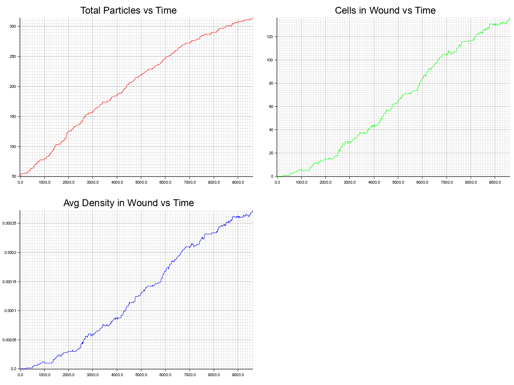
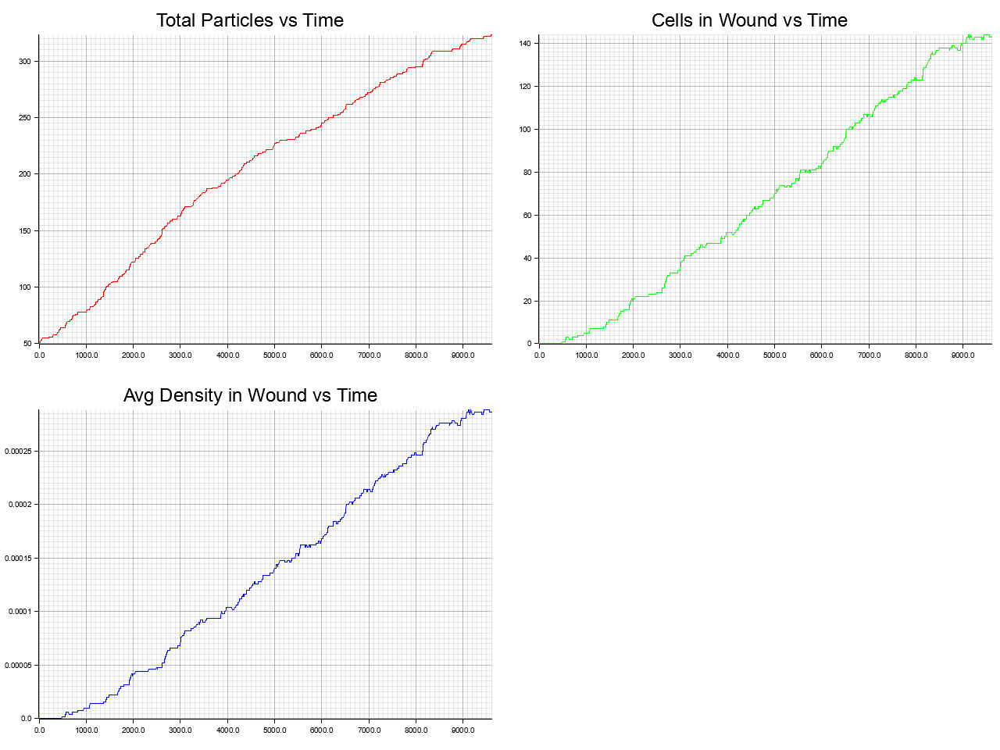

# Modelling Collective Cell Migration in Wound Healing

## Introduction

Collective cell migration (CCM) is a fundamental biological process integral to wound healing, embryonic development, and unfortunately, cancer cell invasion and metastasis (Haeger et al., 2015). Unlike individual cell movement, CCM involves the coordinated movement of cell groups, often in sheets or clusters, guided by complex intercellular signaling and mechanical interactions (Qin et al., 2021). Understanding the mechanisms driving CCM is crucial for numerous advancements, not the least of which being the development therapeutic strategies for various physiological and pathological conditions.

The study of CCM has benefited significantly from computational modeling, which allows for the systematic exploration of how individual cell behaviors and interactions give rise to emergent collective migration. Agent-based models (ABMs) are particularly well-suited for this purpose, as they simulate the actions and interactions of autonomous agents (cells) based on a set of prescribed rules (Bindschadler & McGrath, 2007). Other modeling approaches might include continuum models or hybrid models (which use continuum model and ABM aspects together), although they are outside the scope of this paper.

This paper describes an agent-based simulation framework designed to model CCM, with a particular focus on the process of wound closure in a two-dimensional cell monolayer. We detail the core components of the model, including cell representation, environmental setup, and the physics governing cell movement and interactions. A key feature of this framework is the incorporation of several distinct biasing mechanisms that influence cell directionality, including leader-follower dynamics, density gradient sensing, and cell-cell adhesion. We will explore how these biases, inspired by recent experimental findings (Bijonowski et al., 2025; Lin et al., 2025; Qin et al., 2021), affect simulated wound healing, and discuss the emergent collective behaviors observed under different biasing conditions.

## Model Definition

The simulation employs an agent-based model where individual cells are the primary agents interacting within a defined universe.

### Cell Representation

Each cell $n$ is modeled as a 2D circular agent with a fixed diameter $l_m$. The radius of a cell is thus $r_c = l_m/2$. The state of each cell $n$ at a given time $t$ is characterized by:

*   **Position:** A vector $\vec{x}_n(t) = (x_n(t), y_n(t))$ representing the coordinates of the cell's center.
*   **Velocity:** A vector $\vec{v}_n(t) = (v_{x,n}(t), v_{y,n}(t))$ representing the cell's current velocity.
*   **Orientation:** An angle $\theta_n(t)$ representing the cell's current direction of intended movement. This corresponds to a unit vector $\hat{d}_n(t) = (\cos(\theta_n(t)), \sin(\theta_n(t)))$.

### The Simulation Universe

Cells exist within a two-dimensional Cartesian space of dimensions $L_x \times L_y$. The simulation employs reflective boundary conditions: if a cell's movement would take it outside these boundaries, its position is adjusted to be just inside, and its velocity component normal to the boundary is reflected, scaled by a coefficient of restitution.

### Simulation Parameters

The behavior of cells and the progression of the simulation are governed by a set of parameters, summarized conceptually below (default values from `config.toml` provided as examples):

| Symbol        | Description                             | Example Value                | Source                  |
|---------------|-----------------------------------------|------------------------------|-------------------------|
| $l_m$         | Cell diameter                           | $47.0 \mu m$                 | B&M          |
| $r_c$         | Cell radius ($l_m/2$)                   | $23.5 \mu m$                 | Derived                 |
| $s_{base}$    | Intrinsic cell speed                    | $0.76 \mu m/\text{minute}$   | B&M     |
| $p$           | Cell persistence time                   | $12.3 \text{ minutes}$       | B&M       |
| $dt$          | Physics timestep                        | $0.05 \text{ minutes}$       | Per simulation        |
| $s$           | Speed per timestep ($s_{base} \cdot dt$)  | $0.038 \mu m/dt$            | Derived                 |
| $R_d$         | Division inhibition radius              | $r_c + 3.0 \mu m = 26.5 \mu m$ | B&M ($2-9 \mu m$) |
| $R_s$         | Neighbor sensing radius                 | $r_c + 3.0 \mu m = 26.5 \mu m$ | Same as $R_d$` |
| $d_{max}$     | Max division rate per cell per hour     | $0.04 \text{ divisions/hr}$  | B&M |
| $L_x, L_y$    | Universe dimensions                     | $1000 \mu m \times 1000 \mu m$ | Per simulation |
| $\tau_{rec}$  | Data recording interval                 | $5.0 \text{ minutes}$       | Per simulation (multiple of $dt$)   |

The term $c_s$ (noted as ideal_proc in the configuration scripts) dictates the degree of randomness when a cell loses persistence and chooses a new direction under the influence of a bias. A value of $c_s=1$ implies the cell perfectly aligns with the calculated biased direction, while $c_s < 1$ introduces angular scatter according the formula $(1.0 - c_s) * \pi / 2$ as the standard deviation of a Gaussian distribution.

## Initial Conditions

The simulation starts at $t=0$ with a predefined "wound" geometry. For the simulations discussed, a "straight\_edge" wound type is used:

*   A region $A_0$ is populated by cells, forming a contiguous monolayer. In the "straight\_edge" setup, $A_0$ typically corresponds to one half of the simulation domain, e.g., $x_n(0) < L_x / 2$. Specifically, cells are placed within $x \in [r_c, X_{edge} - r_c]$ and $y \in [r_c, L_y - r_c]$, where $X_{edge}$ is the wound edge (e.g., $L_x/2 = 500 \mu m$ from `wound_param1 = 500000.0 nm`).
*   The incident region $A_i$ (e.g., $x_n(0) \ge X_{edge}$) is initially cell-free and represents the "wound" area.
*   Initial cell positions are determined using a scattered distribution of a set number of initial cells, given a short period to settle into a random arrangement. The initial cell count is set to $N_{cells} = 50$ for the simulations discussed.
*   Each cell $n$ is assigned a random initial orientation $\theta_n(0) \sim U(0, 2\pi)$.
*   Initial cell velocities $\vec{v}_n(0)$ are set to $\vec{0}$.

## Simulation Dynamics

The simulation proceeds in discrete timesteps $dt$. In each timestep, the state of all cells is updated. This involves several stages:

### 1. Spatial Grid Construction

To efficiently identify neighboring cells for interaction checks (e.g., collisions, sensing), a spatial grid is constructed or updated at the beginning of each timestep.
The grid partitions the 2D universe into cells of size comparable to the sensing radius $R_s$. Each particle is assigned to a grid cell based on its current position. Counts of particles per grid cell and prefix sums of these counts are computed to create a sorted list of particle indices, allowing for fast querying of particles within a specific grid cell or its neighborhood.

### 2. Density and Gradient Calculation

Cell density $\rho(\text{grid\_cell}, t)$ for each grid cell is calculated as the number of cells within it divided by the grid cell's area.
The spatial gradient of this density, $\nabla\rho(\text{grid\_cell}, t)$, is then computed using a central difference scheme:
$$ \frac{\partial \rho}{\partial x} \approx \frac{\rho(i+1,j) - \rho(i-1,j)}{2 \cdot \Delta g} $$
$$ \frac{\partial \rho}{\partial y} \approx \frac{\rho(i,j+1) - \rho(i,j-1)}{2 \cdot \Delta g} $$
where $\Delta g$ is the grid cell size. These gradients are used if density-gradient-based biasing is active. For performance, effective gradient vectors for each grid cell are pre-calculated based on a multi-scale density analysis (detailed in Section 5.2) if the density gradient bias is enabled.

### 3. Cell Physics Update

The core of the simulation step involves updating the position, velocity, and orientation of each cell $n$. This is performed in parallel for all cells.

#### A. Determine Target Velocity and Orientation

A cell's intended movement is influenced by its persistence, and potentially by various biasing factors and adhesion to neighbors.

*   **Persistence:** A cell loses its directional persistence with a probability $P_{change}(dt) = 1 - e^{-dt/p}$, where $p$ is the persistence time. A random number $u_1 \sim U(0,1)$ is generated.
    *   If $u_1 \ge P_{change}$: The cell persists. Its desired direction of movement $\vec{d}_{desired}$ remains aligned with its current orientation $\theta_n(t)$.
    *   If $u_1 < P_{change}$: The cell loses persistence. Its new desired direction $\vec{d}_{desired}$ is determined by active biases:
        1.  An overall bias vector $\vec{B}$ is initialized to $\vec{0}$.
        2.  **Primary Bias:** If a primary bias (Leader or Density Gradient) is active, its contribution is calculated (see Section 5) and added to $\vec{B}$.
        3.  **Adhesion Bias:** If cell-cell adhesion is enabled, its contribution (see Section 5.3) is calculated and added to $\vec{B}$.
        4.  **Final Desired Direction:**
            *   If $\vec{B} \neq \vec{0}$: The ideal biased direction is $\vec{d}_{ideal} = \vec{B} / ||\vec{B}||$. The actual desired direction $\vec{d}_{desired}$ is obtained by rotating $\vec{d}_{ideal}$ by an angle $\Delta\phi$. $\Delta\phi$ is sampled from a Normal distribution $N(0, \sigma_{scatter}^2)$, where the standard deviation $\sigma_{scatter} = (1-c_s) \cdot \frac{\pi}{2}$, and $c_s$ is the ideal occurrence coefficient.
            *   If $\vec{B} = \vec{0}$: A new random orientation is chosen: $\theta_{desired} \sim U(0, 2\pi)$, and $\vec{d}_{desired} = (\cos\theta_{desired}, \sin\theta_{desired})$.

*   **Target Velocity:** The target velocity for the current timestep is $\vec{v}_{target} = \vec{d}_{desired} \cdot s$, where $s$ is the intrinsic speed per timestep.
*   **Update Velocity (Inertia):** The cell's velocity $\vec{v}_n(t)$ is updated towards $\vec{v}_{target}$ based on an inertia factor $I_f$:
    $$ \vec{v}_{n,new} = \vec{v}_n(t) + (\vec{v}_{target} - \vec{v}_n(t)) \cdot I_f \cdot dt $$
    The new intended orientation $\theta_{n,intended}$ is derived from the direction of $\vec{v}_{n,new}$.

#### B. Calculate Tentative Position

The cell's tentative new position is calculated by:
$$ \vec{x}_{n,tentative} = \vec{x}_n(t) + \vec{v}_{n,new} \cdot dt $$

#### C. Collision Detection and Response

Collisions are handled using a physics-based approach considering momentum, restitution, and friction.
*   Identify the set $J$ of neighboring cells $j$ such that the distance between $\vec{x}_{n,tentative}$ and $\vec{x}_j(t)$ is less than the cell diameter $l_m$.
*   **No Collision ($J$ is empty):** The tentative move is accepted.
    $\vec{x}_{n,next} = \vec{x}_{n,tentative}$, $\vec{v}_{n,effective} = \vec{v}_{n,new}$, and $\theta_{n,effective} = \theta_{n,intended}$.
*   **Collision ($J$ is not empty):** For the first detected colliding neighbor $j$:
    1.  Define the collision normal vector $\hat{n} = (\vec{x}_n(t) - \vec{x}_j(t)) / ||\vec{x}_n(t) - \vec{x}_j(t)||$ and tangent $\hat{t}$.
    2.  Decompose the current cell's new velocity $\vec{v}_{n,new}$ and neighbor $j$'s current velocity $\vec{v}_j(t)$ into components along $\hat{n}$ and $\hat{t}$: $(v_{1n}, v_{1t})$ and $(v_{2n}, v_{2t})$ respectively.
    3.  The post-collision normal velocity for cell $n$ (assuming equal mass $m=1$) is:
        $$ v'_{1n} = \frac{(1-\epsilon_r)v_{1n} + (1+\epsilon_r)v_{2n}}{2} $$
        where $\epsilon_r$ is the coefficient of restitution.
    4.  The post-collision tangential velocity for cell $n$ is affected by friction:
        $$ v'_{1t} = v_{1t} (1 - \mu_f) $$
        where $\mu_f$ is the coefficient of friction.
    5.  The cell's effective velocity after collision is $\vec{v}_{n,effective} = v'_{1n}\hat{n} + v'_{1t}\hat{t}$.
    6.  The next position is $\vec{x}_{n,next} = \vec{x}_n(t) + \vec{v}_{n,effective} \cdot dt$.
    7.  **Overlap Resolution:** If $\text{dist}(\vec{x}_{n,next}, \vec{x}_j(t)) < l_m$, $\vec{x}_{n,next}$ is pushed slightly along $\hat{n}$ to resolve the overlap, ensuring a minimum separation.
    8.  The effective orientation $\theta_{n,effective}$ is derived from $\vec{v}_{n,effective}$.

#### D. Apply Boundary Conditions

*   If the calculated position $\vec{x}_{n,next}$ lies outside the domain boundaries:
    *   The final position $\vec{x}_{n,final}$ is adjusted to be just inside the boundary.
    *   The component of $\vec{v}_{n,effective}$ normal to the boundary is reflected and scaled by $\epsilon_r$: $v_{normal,final} = -v_{normal,effective} \cdot \epsilon_r$. The tangential component remains (or can be scaled by boundary friction, though not explicitly detailed here beyond restitution). The velocity vector is updated to $\vec{v}_{n,final}$.
    *   The final orientation $\theta_{n,final}$ is derived from $\vec{v}_{n,final}$.
*   If no boundary collision occurred, $\vec{x}_{n,final} = \vec{x}_{n,next}$, $\vec{v}_{n,final} = \vec{v}_{n,effective}$, and $\theta_{n,final} = \theta_{n,effective}$.

#### E. Update Cell State

The cell's state for the next timestep $t+dt$ is set:
$$ \vec{x}_n(t+dt) = \vec{x}_{n,final} $$
$$ \vec{v}_n(t+dt) = \vec{v}_{n,final} $$
$$ \theta_n(t+dt) = \theta_{n,final} $$

### 4. Leader Update

If the leader cell bias is active, leader cells are re-evaluated periodically (controlled by `leader_update_interval_steps`). The selection process is:
1.  Identify the largest contiguous "wound" region (empty grid cells) using a Breadth-First Search (BFS), starting from empty grid cells that are adjacent to the main cell mass and fall within the original geometric wound area.
2.  Identify "interface cells": cells from the main mass that border this largest wound component.
3.  Score these interface cells based on their "exposure" – the number of adjacent wound grid cells.
4.  Select a pre-defined percentage (`leader_percentage`) of cells as leaders. Priority is given to highly exposed cells at the "top" (maximum Y-coordinate) and "bottom" (minimum Y-coordinate) of the wound front, with remaining slots filled by other highly exposed interface cells.
Marked cells have an `is_leader` flag set.

### 5. Cell Division

Cell division is a stochastic process that occurs after all cells have completed their physics updates for the current timestep $dt$. For each cell $n$:
1.  Count the number of neighboring cells $N_{inh}$ whose centers are within the division inhibition radius $R_d$ of cell $n$'s center.
2.  If $N_{inh} > 0$, the cell is contact-inhibited and cannot divide in this step.
3.  If $N_{inh} = 0$:
    *   The cell attempts to divide with a probability $P_{div} = d_{max} \cdot (dt/60)$, where $d_{max}$ is the maximum division rate per hour.
    *   If a random number $u_2 \sim U(0,1)$ is less than $P_{div}$, the cell divides:
        *   A new daughter cell $k$ is created.
        *   The daughter cell is placed adjacent to the parent cell $n$ at a position $\vec{x}_k(t+dt) = \vec{x}_n(t+dt) + (r_c + \epsilon_{sep}) \cdot (\cos\phi_{place}, \sin\phi_{place})$. $\phi_{place} \sim U(0,2\pi)$ is a random placement angle, and $\epsilon_{sep}$ is a small offset (e.g., $0.01 \mu m$) ensuring initial separation. Placement attempts are made to find a non-overlapping position.
        *   The daughter cell is assigned a random initial orientation $\theta_k(t+dt) \sim U(0,2\pi)$ and zero initial velocity.
        *   If the parent cell was a leader, the daughter cell inherits leader status.
        *   The parent cell $n$ remains with its updated state.

## Bias Mechanisms in Detail

The simulation framework incorporates several mechanisms to bias cell movement, drawing inspiration from biological observations of leader-follower dynamics, chemotaxis-like responses to density gradients, and the coordinating effects of cell-cell adhesion.

### 5.1 Leader-Follower Dynamics

Collective cell migration often exhibits a "leader-follower" pattern, where specialized "leader" cells at the migrating front guide the movement of "follower" cells (Qin et al., 2021). Our simulation models this (`primary_bias = "leaders"`):

*   **Leader Selection:** As described in Section 4.4, leader cells are dynamically identified based on their position relative to the wound front and their exposure to the empty wound space.
*   **Follower Bias:** When a follower cell loses persistence, its movement is biased towards its nearest identified leader cell. The bias vector contribution is $\vec{B}_{leader} = \hat{u}_{NL} \cdot S_{L}$, where $\hat{u}_{NL}$ is the unit vector pointing from the follower to the nearest leader, and $S_L$ is the `leader_bias_strength`. This creates a "pulling" effect from the leaders.

### 5.2 Density Gradient Bias

Cells can exhibit directed migration in response to chemoattractant gradients or, analogously, density gradients. Lin et al. (2025) observed that epithelial monolayers accumulate higher cell density before entering narrower (more confined) regions, suggesting a response to local crowding. Our simulation implements a density gradient bias (`primary_bias = "densitygradient"`) where cells are biased to move towards regions of lower cell density (i.e., along $-\nabla\rho$).

The gradient vector $\vec{G}_{cached}$ used for this bias is pre-calculated for each grid cell based on `calculate_improved_density_gradient_bias`. This function combines:
1.  **Local Gradient:** The immediate density gradient $\nabla\rho$ at the cell's current grid location.
2.  **Medium-Range Gradient:** A gradient calculated over a larger stencil (e.g., $\pm 2$ grid cells) around the cell's location, capturing broader density variations.
3.  **Global Gradient Influence:** The gradient direction is also influenced by a bilinear interpolation of density gradients from the four surrounding grid cell centers. This provides a smoother, less grid-artifact-prone global directional cue. The strength of this global component is modulated by the normalized local density relative to the maximum observed density ($ \rho_{current} / \rho_{max} $), making the global pull stronger in denser regions.

These components are weighted and combined, and the resulting vector is scaled by `density_bias_strength` to give the contribution $\vec{B}_{density} = \vec{G}_{cached}$ to the overall bias vector.

### 5.3 Cell-Cell Adhesion

Intercellular adhesions are crucial for coordinated movement. Bijonowski et al. (2025) demonstrated that artificial cell-cell adhesions, even without direct cytoskeletal linkage, can induce collective migration by increasing membrane tension and activating downstream signaling, leading to a more unified front and increased correlation length. Our simulation incorporates an adhesion mechanism (`enable_adhesion = true`):

1.  **Probabilistic Adhesion:** When a cell $n$ considers its movement, for each neighbor $j$ within its sensing radius $R_s$, an adhesive link is formed stochastically with probability $P_{adhesion}$ (`adhesion_probability`).
2.  **Directional Influence:** If an adhesive link forms with a moving neighbor $j$ (i.e., $\vec{v}_j(t) \neq \vec{0}$), the normalized direction of the neighbor's velocity, $\hat{v}_j(t)$, contributes to an `adhesion_influence_vector` $\vec{A}$ for cell $n$.
3.  **Bias Integration:** The accumulated $\vec{A}$ is averaged (if multiple adhered neighbors) and normalized. This directional influence is then scaled by `adhesion_strength` ($S_A$) and added to the primary bias vector: $\vec{B}_{adhesion} = \hat{A} \cdot S_A$.

This mechanism encourages local alignment of movement, promoting cohesive migration.

## Simulation Experiments and Results

To investigate the impact of these biasing mechanisms, five distinct simulation scenarios were run using the parameters from `config.toml`, varying only the bias settings. All simulations ran for a total of 9600 minutes, with data recorded every 5 minutes. The key metrics tracked are Total Particle Count, Cell Count in Wound, and Average Density in Wound ($\text{cells}/\mu m^2$).

1.  **No Bias (Baseline):** `primary_bias = "none"`, `enable_adhesion = false`.
    *   *Results:* The simulation showed a roughly linear increase in Total Particles, peaking around 310 cells before decaying slightly towards the end. Cells in Wound and Average Density in Wound increased steadily, reaching approximately 140 cells and a density of $0.00026 \text{ cells}/\mu m^2$, respectively, without the late-stage decay observed in total cell count.
    *   

2.  **Leader Bias Only:** `primary_bias = "leaders"`, `enable_adhesion = false`. Configuration used `leader_percentage = 0.05`, `leader_update_interval_steps = 10`, `leader_bias_strength = 3.0`.
    *   *Results:* This scenario yielded significantly improved wound healing. The Total Particle count reached about 350 cells without noticeable decay. The Cell Count in Wound rose to approximately 180 cells, and the Average Density in Wound reached $0.00035 \text{ cells}/\mu m^2$. The rate of increase for wound metrics was visibly faster than the baseline.
    *   

3.  **Density Gradient Bias Only:** `primary_bias = "densitygradient"`, `enable_adhesion = false`. Configuration used `density_bias_strength = 30.0`, `density_gradient_update_interval_steps = 10`.
    *   *Results:* This bias type performed poorly, with outcomes very similar to the no-bias baseline. Total Particles reached about 300, Cells in Wound about 140, and Average Density in Wound about $0.00026 \text{ cells}/\mu m^2$. This suggests the current implementation or parameterization of the density gradient bias is not effectively promoting wound closure.
    *   

4.  **Adhesion Only (No Primary Bias):** `primary_bias = "none"`, `enable_adhesion = true`. Configuration used `adhesion_probability = 0.1`, `adhesion_strength = 0.8`.
    *   *Results:* Cell adhesion alone showed a modest improvement over the no-bias baseline. Total Particles reached approximately 325, Cells in Wound around 145, and Average Density in Wound slightly higher at $0.00029 \text{ cells}/\mu m^2$.
    *   

5.  **Leader Bias with Adhesion:** `primary_bias = "leaders"`, `enable_adhesion = true`. (Leader and adhesion parameters as above).
    *   *Results:* The addition of adhesion to the leader bias did not significantly alter the outcome compared to the leader bias alone. Final metrics were very similar: ~350 total cells, ~180 cells in wound, and ~0.00035 average density.
    *   

## Discussion

The simulation results highlight the differential impact of various biasing strategies on collective cell migration and wound closure. The leader-follower mechanism, where a small fraction of cells at the wound edge guide the others, proved to be the most effective in promoting robust and rapid wound healing in this model. This aligns with biological observations where leader cells play a crucial role in orchestrating directional movement (Qin et al., 2021).

The density gradient bias, despite employing a multi-scale approach to calculate gradients, did not enhance wound closure compared to the baseline. This suggests that either the specific implementation requires further refinement, the `density_bias_strength` (30.0) was not optimally tuned relative to other cellular forces (like persistence or collision effects), or the way cells perceive and respond to such gradients in our model does not capture the biological reality effectively. Lin et al. (2025) describe density accumulation and faster migration in confinement, implying cells move *into* denser, confined areas if that leads to faster progress, which is a more complex response than simply moving down a density gradient.

Cell-cell adhesion, when implemented as the sole biasing mechanism, provided a slight improvement in wound healing metrics. This is consistent with findings by Bijonowski et al. (2025), who showed that intercellular adhesions can promote collective migration. However, the simulated adhesion did not include an increase in individual cell speed upon adhesion, a factor noted by Bijonowski et al. Incorporating such a feature might amplify the positive effects of adhesion.

Interestingly, when adhesion was combined with the strong leader bias, no significant additive benefit was observed. The simulations presented used an `ideal_proc` ($c_s$) of 1.0, meaning cells perfectly followed the (potentially combined) bias direction when they lost persistence. This high degree of deterministic response to the leader bias might already induce strong cell grouping and coordinated movement, potentially overshadowing the more subtle, local coordinating effects of the adhesion mechanism. Future experiments with $c_s < 1.0$ would introduce more stochasticity into individual cell movements, potentially allowing the organizational effects of adhesion to become more apparent, especially in use with a primary bias.

The collision model used in this simulation is physics-based, relying on momentum transfer, restitution, and friction, which differs from the simpler rule-based collision response originally planned. In the current model, collective cohesion arises primarily from the explicit bias and adhesion mechanisms rather than emerging purely from collision rules.

## Conclusion

This paper presented an agent-based model for simulating collective cell migration, incorporating detailed physics for cell movement and interactions, along with several biologically inspired biasing mechanisms. The leader-follower dynamic emerged as a potent driver of simulated wound closure. While the cell-cell adhesion mechanism showed modest benefits, its interplay with other factors, such as the stochasticity of cell movement and potential adhesion-induced changes in cell speed, warrants further investigation. The density gradient bias, in its current form, did not improve outcomes, indicating a need for refinement.

Future work will focus on refining the density gradient response, incorporating more nuanced effects of cell adhesion, and systematically exploring the parameter space, particularly the interplay between bias strengths and the `ideal_proc` ($c_s$) parameter, to better understand the emergence of robust collective behaviors. This simulation framework provides a flexible platform for dissecting the complex interplay of factors governing collective cell migration.

All works are available at [GitHub/ZeroUniRice](https://github.com/ZeroUniRice/simulation-engine) under the simulation-engine repository. The simulation engine is implemented in rust, and contains an additionally library for the result visualization. All the simulations mentioned in this paper are available with their video and data figures in the `assets` folder.

## Final Notes

In the original outline I mention using an R-tree for neighbor searching, but I ended up using a grid-based approach. While this would generally be a good approach, at the end of the day an R-tree (Rectangle tree) uses an MBR grid system, not unlike the grids used here. The primary reason a uniform grid was used is that it allows for easier chunked computations (such as density calculations) and allows us to understanding the entire simulation space as a whole.

## References

Bijonowski, B. M., Park, J., Bergert, M., Teubert, C., Diz-Muñoz, A., Galic, M., & Wegner, S. V. (2025). Intercellular adhesion boots collective cell migration through elevated membrane tension. Nature communications, 16(1), 1588. https://doi.org/10.1038/s41467-025-56941-4

Bindschadler, M., & McGrath, J. L. (2007). Sheet migration by wounded monolayers as an emergent property of single-cell dynamics. Journal of cell science, 120(Pt 5), 876–884. https://doi.org/10.1242/jcs.03395

Haeger, A., Wolf, K., Zegers, M. M., & Friedl, P. (2015). Collective cell migration: guidance principles and hierarchies. Trends in Cell Biology, 25(9), 556–566. doi:10.1016/j.tcb.2015.06.003

Li, L., He, Y., Zhao, M., & Jiang, J. (2013). Collective cell migration: Implications for wound healing and cancer invasion. Burns & trauma, 1(1), 21–26. https://doi.org/10.4103/2321-3868.113331

Lin, W. J., Yu, H., & Pathak, A. (2025). Gradients in cell density and shape transitions drive collective cell migration into confining environments. Soft matter, 21(4), 719–728. https://doi.org/10.1039/d3sm01240a

Qin, L., Yang, D., Yi, W., Cao, H., & Xiao, G. (2021). Roles of leader and follower cells in collective cell migration. Molecular biology of the cell, 32(14), 1267–1272. https://doi.org/10.1091/mbc.E20-10-0681